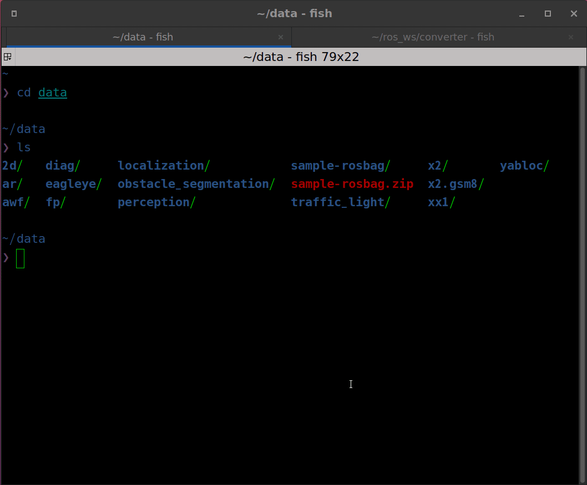

# autoware_msg_bag_converter

Migrates legacy Autoware rosbags to current message and topic definitions: `autoware_auto_*` renames,
`tier4_planning_msgs` → `autoware_internal_planning_msgs` moves, IDL version upgrades, topic renames,
and cross-topic field injection.

## How it works

The converter streams messages from input bag to output bag and applies rules in
[`converters/`](autoware_msg_bag_converter/converters/) (merged in `__init__.py`) and
[`engine.py`](autoware_msg_bag_converter/engine.py):

- **Default type rename (passthrough)**: `autoware_auto_<pkg>` → `autoware_<pkg>`; CDR bytes unchanged
- **Package prefix (passthrough)**: `control_validator` / `planning_validator` / `vehicle_cmd_gate` →
  `autoware_*`
- **Package rename (passthrough)**: `tier4_planning_msgs` → `autoware_internal_planning_msgs`
- **Payload rewrite**: deserialize old message, build new message, serialize
- **Cross-topic merge**: currently only `CandidateTrajectory.turn_indicators_command` (see 2026/07
  below)

Old bag layouts are read via vendored packages under [`old_msgs/`](old_msgs/):

- `autoware_perception_msgs_v1_7`
- `autoware_internal_planning_msgs_v1_13`

Current message types for serialization are provided by the workspace.

Other behavior: QoS profiles are copied from input `metadata.yaml` to output; storage format
(sqlite3 / mcap) is detected automatically and preserved.

## Conversion changelog

### 2024/08 — `autoware_auto_*` migration (initial scope)

Autoware renamed message packages from `autoware_auto_*` to `autoware_*`. Most types only need a
type-string update in bag metadata; the binary payload is unchanged. A few types also changed field
layout and are rebuilt message-by-message.

- **Default rule**: any `autoware_auto_<pkg>/msg/<Type>` not listed below becomes
  `autoware_<pkg>/msg/<Type>` with the same CDR bytes
- **Validator / gate packages**: topics under `control_validator`, `planning_validator`, or
  `vehicle_cmd_gate` get an `autoware_` prefix (payload unchanged)
- **`AckermannControlCommand` → `Control`**: control message was split into `lateral` /
  `longitudinal`; `speed` is renamed to `velocity`; new `is_defined_*` flags are set from available
  fields
- **`PathWithLaneId` (auto) → tier4 `PathWithLaneId`**: path points are wrapped in a new
  `PathPoint` structure (later moved to `autoware_internal_planning_msgs` in 2025/02)
- **`HADMapRoute` → `LaneletRoute`**: route segments now use `LaneletPrimitive` objects;
  `allow_modification` is added and set to `false`
- **`TrafficSignalArray` → `TrafficLightGroupArray`**: perception traffic-light messages were
  renamed; `signals[]` becomes `traffic_light_groups[]`, and signal / map IDs are mapped to
  `traffic_light_group_id`

### 2025/02 — tier4 planning messages moved to `autoware_internal_planning_msgs`

Several planning types were upstreamed from Tier IV packages into Autoware internal messages. Only
the package name in metadata changes; message fields are identical.

- `Scenario`, `PathWithLaneId`: `tier4_planning_msgs` → `autoware_internal_planning_msgs`

### 2025/03 — `RouteState` moved to internal planning messages

Same package rename as above.

- `RouteState`: `tier4_planning_msgs` → `autoware_internal_planning_msgs`

### 2025/05 — velocity-limit types + traffic-light IDL version

**Velocity limits**: `VelocityLimit` and `ClearVelocityLimit` follow the same tier4 → internal
rename (passthrough).

**Traffic lights**: older bags store `TrafficLightGroupArray` in a previous IDL revision. The
converter deserializes with vendored `autoware_perception_msgs_v1_7`, then writes the current
`autoware_perception_msgs` layout so replay tools built against the new IDL can read the bag.

### 2025/07 — PointCloud2 field layout (lidar preprocessing)

Lidar point clouds in old bags use legacy field names and offsets. The message type stays
`sensor_msgs/PointCloud2`; only the `fields` layout and point data are converted
([`converters/pointcloud_202507.py`](autoware_msg_bag_converter/converters/pointcloud_202507.py)):

- **`xyz` / `xyzi` / `xyzir` → `xyzirc`**: adds `return_type` and `channel`; `intensity` becomes
  `uint8`; Velodyne `ring` maps to `channel`
- **`xyziradrt` → `xyzircaedt`**: keeps azimuth / elevation / distance; converts azimuth units and
  rewrites per-point `time_stamp` from absolute double seconds to relative nanoseconds (`uint32`)
- Already in `xyzirc` layout, or an unrecognized layout: left as-is (unsupported layouts log a
  warning)

### 2025/08 — planning trajectory topic rename

Topic path was shortened in the planning stack; message type is unchanged.

- `/planning/scenario_planning/trajectory` → `/planning/trajectory`

### 2026/07 — `turn_indicators_command` on candidate trajectories

`CandidateTrajectory` gained a `turn_indicators_command` field. Old bags have no per-trajectory
turn-signal data, so the converter fills it from the vehicle status topic recorded in the same bag.

- **Types**: `CandidateTrajectories`, `ScoredCandidateTrajectories` (all topics using these types)
- **Read**: vendored `autoware_internal_planning_msgs_v1_13` (pre-field layout)
- **Write**: current `autoware_internal_planning_msgs` with `turn_indicators_command` on each
  nested `CandidateTrajectory`
- **Source topic**: `/vehicle/status/turn_indicators_status` (`TurnIndicatorsReport`)
- **Alignment**: for each candidate message, use the latest status report whose bag timestamp is
  ≤ the message timestamp; map `report` values directly to `TurnIndicatorsCommand.command`
- **Note**: every candidate inside one `CandidateTrajectories` message receives the same command
  (old recordings have no per-candidate turn signal)

## preparation

1. create ros2 workspace for converter (ex. $HOME/ros_ws/converter)
2. clone this repository into converter workspace
3. clone dependency repos
4. copy old msg packages to src directory
5. build converter workspace

Example command is below.

```shell
mkdir -p $HOME/ros_ws/converter/src
cd $HOME/ros_ws/converter/src
git clone https://github.com/autowarefoundation/autoware_msg_bag_converter.git
cd autoware_msg_bag_converter
cp -r old_msgs ..
vcs import .. < dependency.repos
cd $HOME/ros_ws/converter
rosdep update
rosdep install -y --from-paths . --ignore-src --rosdistro $ROS_DISTRO
colcon build --symlink-install --cmake-args -DCMAKE_EXPORT_COMPILE_COMMANDS=ON -DCMAKE_BUILD_TYPE=Release
```

## usage

```shell
cd $HOME/ros_ws/converter
source install/setup.bash
cd src/autoware_msg_bag_converter/autoware_msg_bag_converter

# convert one bag
python3 main.py ${input_bag_dir} ${output_bag_dir}

# convert multi bags in directory
python3 main.py ${input_bag_dir_root} ${output_bag_dir_root} -d
```

```shell
# example
$ tree
bag_root # <- input_bag_dir_root
├── sample_mcap # <- input_bag_dir
│   ├── metadata.yaml
│   └── sample_mcap_0.db3
└── sample_sqlite3 # <- input_bag_dir
    ├── metadata.yaml
    └── sample_sqlite3_0.db3
```

## demo

~~convert the [tutorial](https://autowarefoundation.github.io/autoware-documentation/main/tutorials/ad-hoc-simulation/rosbag-replay-simulation/) bag file.~~
Conversion is not necessary because the bag has been uploaded already changed to autoware_msg since 6/7/2024


